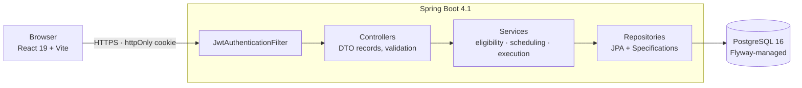

<div align="center">

# CareRoute

**Scheduling and visit management for home &amp; community care agencies**

Coordinators schedule caregiver visits against real operational constraints. Caregivers check in, complete care-plan tasks, and check out from the field.

[](#tech-stack)
[](#tech-stack)
[](#tech-stack)
[](#deployment)

[Live demo](#) · [Product requirements](docs/PRD.md) · [Implementation plan](docs/PLAN.md)

</div>

---

> **Replace before publishing:** the live demo link above, the screenshots in [Screenshots](#screenshots), and the demo credentials in [Demo accounts](#demo-accounts).

## Screenshots

<!-- Replace these with real captures once Phase 6 is complete. -->

| Schedule board | Assign flow |
|---|---|
| _screenshot_ | _screenshot_ |

| Caregiver day view (mobile) | Coordinator dashboard |
|---|---|
| _screenshot_ | _screenshot_ |

---

## The problem

Home care agencies coordinate a workforce that never sets foot in a central office. Scheduling a single visit means satisfying three constraints at once: the caregiver is not already booked, they actually work that day and hour, and they hold the qualification the visit requires. Handled in spreadsheets, this produces double-bookings, unqualified assignments, and no reliable record that a visit happened at all.

CareRoute enforces those constraints in the API rather than the UI, and it explains its refusals. When a coordinator opens the assign dialog, ineligible caregivers are not hidden — they are shown with the reason:

```
Sarah Whitfield      Booked 10:00–11:30
Marcus Delaney       Not available Tuesdays
Priya Raman          Missing qualification: NURSING
Tom Alcott           Eligible
```

## Features

**For coordinators**
- Client records with editable care plans and full visit history
- Caregiver profiles with skills and recurring weekly availability
- Schedule board grouped by caregiver, with date navigation and status filters
- Constraint-aware assignment that surfaces the reason for every exclusion
- Dashboard: visits today, unassigned, in progress, completion rate

**For caregivers**
- Mobile-first day view of their own visits, and only their own
- Check in and check out within an enforced time window
- Per-task completion tracking against the client's care plan
- Visit notes

## Business rules

The functional core. Every rule is enforced server-side and covered by both a passing and a rejecting test.

| Rule | Enforcement | On violation |
|---|---|---|
| No overlapping visits for one caregiver | Indexed query on the half-open interval `[start, end)` | `409 Conflict` |
| Visit must fall inside the caregiver's availability | Weekly availability window check | `422 Unprocessable Entity` |
| Caregiver must hold the required skill | Skill set membership | `422 Unprocessable Entity` |
| Check-in only from SCHEDULED, within ±30 min of start | Entity state machine + time tolerance | `409 Conflict` |
| Check-out only from IN_PROGRESS | Entity state machine | `409 Conflict` |
| A completed visit cannot be cancelled | Entity state machine | `409 Conflict` |
| Caregivers may only touch their own visits | Service-layer ownership guard | `403 Forbidden` |
| Concurrent edits are rejected, not silently merged | JPA optimistic locking (`@Version`) | `409 Conflict` |

Two design decisions worth calling out:

- **The state machine lives on the `Visit` entity**, as `canTransitionTo(VisitStatus)`, rather than being scattered as conditionals across services. Illegal transitions are impossible to express, not merely unlikely.
- **One eligibility component, two consumers.** The predicate that rejects an invalid assignment is the same one that powers the eligibility endpoint. The rules cannot drift apart because there is only one copy of them.

## Tech stack

**Backend** — Java 21 · Spring Boot 4.1 · Spring Security (JWT in an httpOnly cookie) · Spring Data JPA with Specifications · PostgreSQL 16 · Flyway · Actuator · JUnit 5 + Testcontainers · Maven

**Frontend** — React 19 · TypeScript · Vite · Tailwind CSS 4 · Zustand · React Router · React Hook Form + Zod · Motion · Lucide · Axios · Vitest + Testing Library + MSW

**Infrastructure** — Docker · Docker Compose · GitHub Actions · Azure Container Apps · Azure Database for PostgreSQL · Azure Static Web Apps

## Architecture



Requests carry the JWT in an httpOnly cookie, with an `Authorization: Bearer` fallback for API testing. Authorization is layered: route matchers in the security config, `@PreAuthorize` role checks on controllers and services, and an ownership guard in the service layer for the "own visits only" rule that role annotations cannot express.

## Getting started

### Prerequisites

Java 21 · Node 20+ · Docker Desktop

### Run it

```bash
git clone <repository-url> careroute
cd careroute
cp .env.example .env          # then edit: set a JWT secret of 32+ characters
```

**1. Database**

```bash
docker compose up -d
```

**2. Backend** — starts on `http://localhost:8080`

```bash
cd backend
./mvnw spring-boot:run -Dspring-boot.run.profiles=dev
```

The `dev` profile seeds roughly 8 clients, 5 caregivers, and 40 visits across the current week. Seeding is idempotent — restarting will not duplicate data.

**3. Frontend** — starts on `http://localhost:5173`

```bash
cd frontend
npm install
npm run dev
```

### Demo accounts

Seeded by the `dev` profile.

| Role | Username | Password |
|---|---|---|
| Coordinator | `coordinator` | `password` |
| Caregiver | `caregiver` | `password` |
| Admin | `admin` | `password` |

### Full stack in Docker

```bash
docker compose -f docker-compose.prod.yml up --build
```

## Configuration

All configuration is environment-driven; no secrets are committed. The backend reads the repository-root `.env` at startup, so `cp .env.example .env` is a required setup step — nothing is hardcoded as a fallback. Real environment variables take precedence over the file, which is how the deployed environments override it.

| Variable | Purpose | Local default |
|---|---|---|
| `DATABASE_DB` / `DATABASE_USER` / `DATABASE_PASSWORD` | Postgres credentials | see `.env.example` |
| `DATABASE_PORT` | Host port for Postgres | `5432` |
| `JWT_SECRET_KEY` | HMAC-SHA256 signing key, **32+ characters** | dev placeholder |
| `JWT_EXPIRATION_TIME` | Token lifetime in ms | `86400000` |
| `JWT_COOKIE_SECURE` | `Secure` flag on the auth cookie | `false` |
| `JWT_COOKIE_SAME_SITE` | `Lax` locally, `None` in production | `Lax` |
| `APP_CORS_ALLOWED_ORIGINS` | Comma-separated allowed origins | `http://localhost:5173` |

> In production the frontend and backend sit on different domains, making every API call cross-site. The auth cookie must be issued `SameSite=None; Secure` or the browser will silently drop it — producing a login that appears to succeed followed by 401s on everything after. Hence the two configurable cookie flags.

## API

Base path `/api/v1`. Errors follow RFC 7807 (`application/problem+json`).

| Method | Endpoint | Role |
|---|---|---|
| `POST` | `/auth/register`, `/auth/login` | public |
| `POST` | `/auth/logout` | authenticated |
| `GET` | `/auth/me` | authenticated |
| `GET` `POST` | `/clients` | coordinator |
| `GET` `PUT` `DELETE` | `/clients/{id}` | coordinator |
| `GET` `POST` | `/clients/{id}/care-plan-tasks` | coordinator |
| `GET` `POST` | `/caregivers` | coordinator |
| `GET` `PUT` | `/caregivers/{id}`, `/caregivers/{id}/availability` | coordinator |
| `GET` `POST` | `/visits` | coordinator |
| `GET` | `/visits/{id}` | coordinator, owning caregiver |
| `GET` | `/visits/eligible-caregivers` | coordinator |
| `POST` | `/visits/{id}/assign`, `/visits/{id}/cancel` | coordinator |
| `POST` | `/visits/{id}/check-in`, `/check-out` | owning caregiver |
| `POST` | `/visits/{id}/tasks/{taskId}/complete` | owning caregiver |
| `GET` | `/visits/my` | caregiver |
| `GET` | `/dashboard/summary` | coordinator |

Full detail in [docs/PRD.md](docs/PRD.md#8-api-surface). With the backend running, the generated OpenAPI document is served at `/v3/api-docs` and Swagger UI at `/swagger-ui.html`.

Liveness is exposed at `/actuator/health`.

## Testing

```bash
cd backend && ./mvnw test     # JUnit 5 + Testcontainers (Docker must be running)
cd frontend && npm test       # Vitest + Testing Library + MSW
```

Backend tests are weighted toward the business rules rather than coverage percentage: each rule has a passing case and a rejecting case, plus boundary coverage where it matters — a visit ending exactly when the next begins must *not* register as a conflict.

## Deployment

Deployed to **Azure, Canada Central (Toronto)** — the nearest region, and one that keeps a healthcare-adjacent project's data in Canada.

| Component | Service |
|---|---|
| Backend container | Azure Container Apps |
| Database | Azure Database for PostgreSQL Flexible Server |
| Frontend | Azure Static Web Apps |
| Images | GitHub Container Registry |
| CI/CD | GitHub Actions with OIDC federated credentials |

Pushes to `main` run tests, build and publish the backend image, and deploy both surfaces. The workflow authenticates via OIDC federation, so no long-lived Azure credential is stored in the repository. Runbook and gotchas in [docs/PLAN.md](docs/PLAN.md#phase-7--azure-deployment-and-cicd).

## Project structure

```
careroute/
├── backend/                  Spring Boot API
│   ├── Dockerfile            multi-stage backend build
│   ├── pom.xml
│   └── src/main/java/com/careroute/backend/
│       ├── config/           security, CORS, JWT properties
│       ├── controller/
│       ├── dto/              record types
│       ├── exception/        ProblemDetail handlers
│       ├── model/            entities + Visit state machine
│       ├── repository/       JPA repos + Specifications
│       ├── security/         JWT filter, UserDetails
│       └── service/          eligibility, scheduling, execution
├── frontend/                 React + Vite SPA
│   ├── package.json
│   └── src/
│       └── api/ components/ features/ hooks/ stores/ context/ lib/ types/
├── docs/
│   ├── PRD.md                requirements, domain model, business rules
│   ├── PLAN.md               phased plan with exit criteria
│   └── DESIGN-BRIEF.md       Claude Design prompt and art direction
├── docker-compose.yml        local Postgres
├── docker-compose.prod.yml   full stack
├── .env                      local config (gitignored)
├── .env.example              template
├── .gitignore
└── README.md
```

## Roadmap

- [ ] Caffeine caching on the dashboard aggregate
- [ ] CSV export of visits by date range
- [ ] Server-sent events for live schedule board updates
- [ ] Refresh token rotation
- [ ] Application Insights dashboard

---

<div align="center">

Built by **Eric Mignardi** · Ancaster, Ontario

</div>
